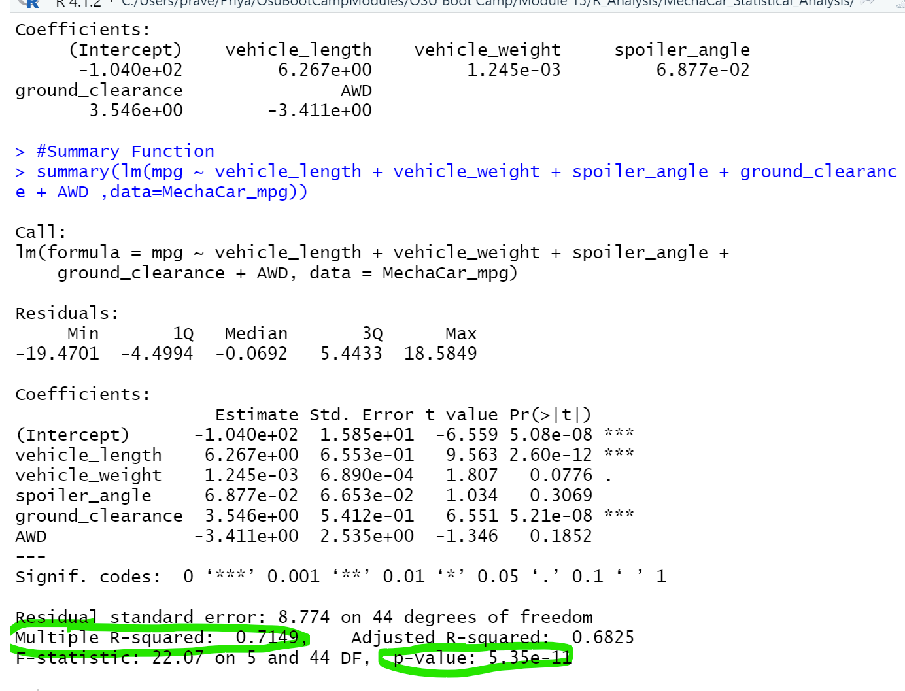
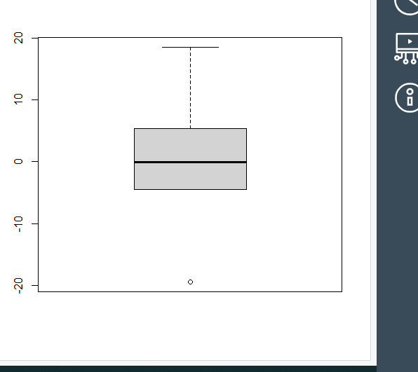
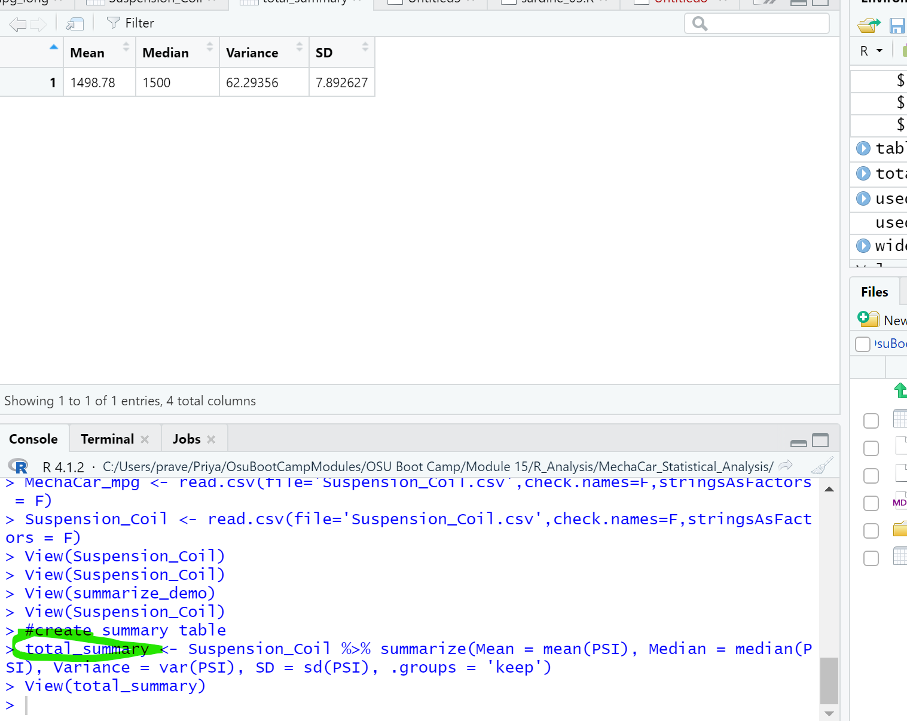
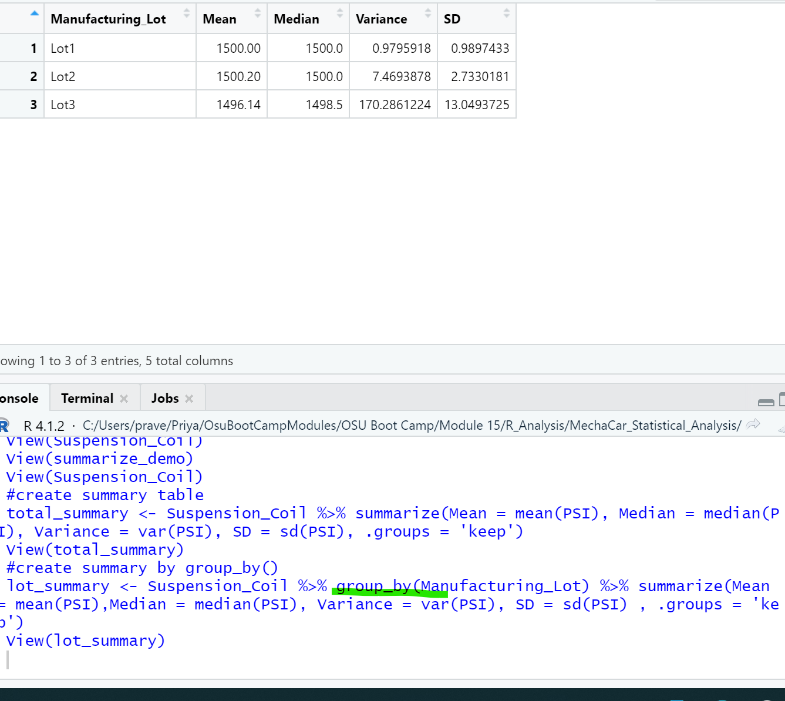
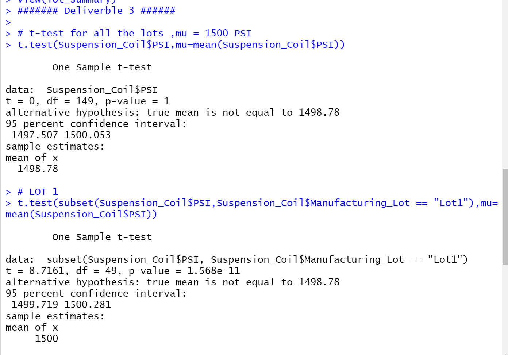
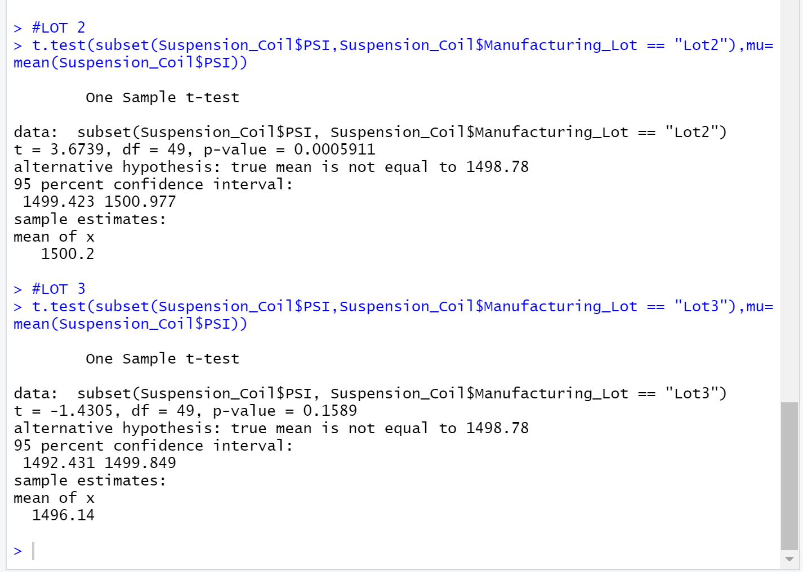

# MechaCar_Statistical_Analysis

## Deliverable 1 
## Linear Regression to Predict MPG
    
The MechaCar_mpg.csv dataset contains mpg test results of 50 prototype,which were produced using multiple design specifications to identify ideal vehicle performance across multiple variables.

### Linear Regression 
   The linear regression was calculated using R in R Studio(R 4.1.2).The R script was applied to the dataset on several variables to get the following coefficients.
   A summary of the linear regression can be displayed to determine the quality of data set.
   
   
   
### Box plot showing the residuals: displaying Median,1Q,3Q,Max,Min

  

  
   
1) Which variables/coefficients provided a non-random amount of variance to the mpg values in the dataset?

    Coefficients:
     mpg: 0 < .05,Statistically significant,non-random amount of variance
     Vehicle length:   0 < .05,   Statistically significant,non-random amount of variance
     Vehicle weight:  .08 > 0.05,  Not statistically significant,random amount of variance
     Spoiler angle:   .31 > 0.05, Not statistically significant,random amount of variance
     Ground Clearance: 0 > .05   Statistically significant, non-random amount of variance
     AWD:             .19>=.05 Not statistically significant,random amount of variance
  
     In summary, vehicle length and ground clearance variables represent non-random amountsof variance as applied to the mpg values.

2) Is the slope of the linear model considered to be zero? Why or why not?

   By converting to scientific notation, all of the slopes of the variables are shown  to be non-zero,some close to zero
   
   Coefficients:
   
    Vehicle length(vl):  6.267
    Vehicle weight (vw):  .001
    Spoiler angle (sa):    .069
    Ground clearance(gc):  3.546
    AWD (awd):              -3.411
  
   The multiple linear regression formula for mpg = -.01+6.267(vl)+ .001(vw)+.069(sa)+3.546(gc)-3.411(awd) which results in a non-zero slope
      
   

3) Does this linear model predict mpg of MechaCar prototypes effectively? Why or why not?

    R-squared value is .7149 which is a strong correlation for the dataset.OR 71% of variance between atual and predicted values can be explained by our model.So effectively,yes.
    
    
## Deliverable 2

## Summary Statistics on Suspension Coils
1)The design specifications for the MechaCar suspension coils dictate that the variance of the suspension coils must not exceed 100 pounds per square inch. Does the current manufacturing data meet this design specification for all manufacturing lots in total and each lot individually? Why or why not?
 
 ### The summary Statisticsof all maufacturing lots is shown below. the mean is 1498.78 for this sample and the population mean was  
       determined as 1500
 
 
 
 
 ### The Overall variance for the total manuafacturing lot is 62 < 100 (in total_summary <100) which is in the expected design   
    specifications, so all good.
 ### However,Lot 3 is an outlier ,cause the variance high and does not meet the design specification.
 
 
 
 
 
 ## Deliverable 3
 ## T-Tests on Suspension Coils
 
### The overall manufacturing  of Lot1 and Lot2  shows a normal distribution as shown below,that is  p>0.05, cannot reject null hypothesis (i.e., mean = 1500).
### However,Lot 3  p<0.05 reject null hypothesis and that dataset is not statistically similar.

 
 
 
 
 
 
 
 
 
 
 
 
    

 
